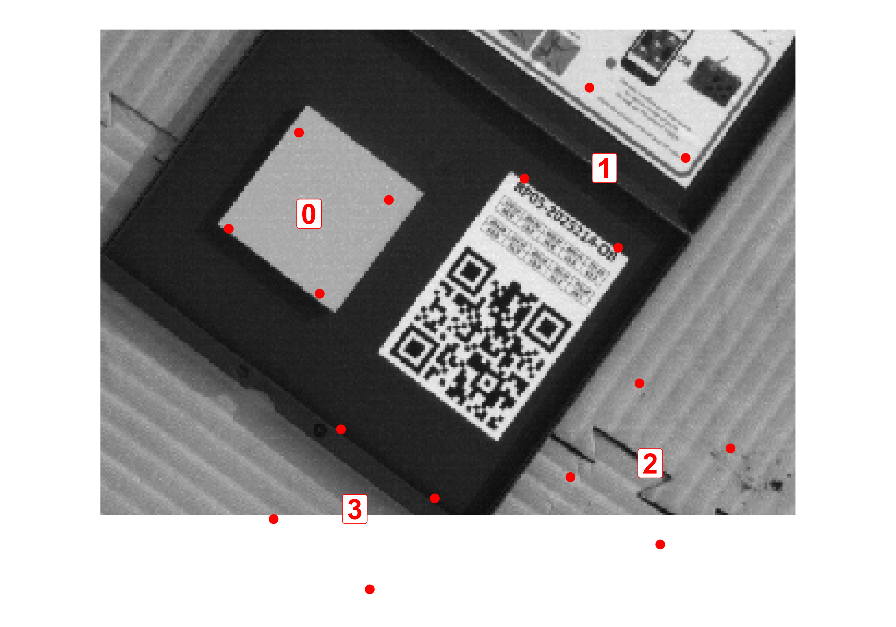

# Micasense RedEdge-MX DUAL processing
Simon Oiry

**WORK IN PROGRESS (last update : 2024-02-09 17:07:57.788931)**

This workflow adapts the Micasense workflow for manual processing of
images from the Micasense RedEdge-MX Dual camera. he original workflow,
written in Python, is available
[here](https://github.com/micasense/imageprocessing). This repository
aims to translate the Python workflow into an R workflow. I’m not really
used to code in Python and I thought it can be a good exercise to try to
translate this repository in R.

The original aims of micasense when they created this processing
workflow was to help researchers and developers to do their own image
processing. While a number of commercial tools fully support processing
MicaSense data into reflectance maps, there are a number of reasons to
process your own data, including controlling the entire radiometric
workflow (for academic or publication reasons), pre-processing images to
be used in a non-radiometric photogrammetry suite, or processing single
sets of 10 images without building a larger map.

I will personally use this workflow to **process single static images**,
where the usual structure-from-motion photogrammetry technique cannot be
used.

## Dual-MX Sensor 

The dual-MX camera have a spectral resolution of 10 bands, ranging from
the blue (444nm) to the NIR (840nm).

## Packages

The first thing to do is to ensure that all the packages are ready to be
used. The [exiftoolr](https://github.com/JoshOBrien/exiftoolr) packages
is used to read Exif of tiff files. After installing the package you
will need to run this line of code : `exiftoolr::install_exiftool()`.

<details>
<summary>Code</summary>

``` r
require(tidyverse)
require(tidyterra)
require(exiftoolr)
require(terra)
require(patchwork)
require(opencv) # install.packages("opencv", repos = "https://ropensci.r-universe.dev")
require(sf)
require(reticulate)

### Setup Python Environnement and packages
# virtualenv_create("myenv")

# py_install("opencv")
# py_install("matplotlib")
```

</details>

## Locate images and Reading metadata used to orthorectify, calibrate and align images

The code is used to find the path for each individual image, identify
each band, and extract all the necessary metadata.

<details>
<summary>Code</summary>

``` r
image_df<-"Dual_MX_Images" %>% 
  list.files(recursive = T, full.names = T) %>% 
  as.data.frame() %>% 
  rename(path = ".") %>% 
  mutate(image_name = gsub(".*/","",path),
         image_ID = substr(image_name,5,8),
         Band = paste0("B",gsub(".*_","",image_name) %>% gsub(".tif","",.))) 

meta <-data.frame(
  Image_name = image_df$image_name,
  Unique_ID = NA,
  Image_Path = image_df$path,
  Make = NA,
  Model = NA,
  Exposure_Time = NA,
  Gain = NA,
  Width = NA,
  Height = NA,
  Band_Name = NA,
  Central_Wavelength = NA,
  Band_Width = NA,
  Capture_ID = NA,
  Flight_ID = NA,
  Focal_Length = NA,
  Black_Level = NA,
  Radiometric_Calibration_a1 = NA,
  Radiometric_Calibration_a2 = NA,
  Radiometric_Calibration_a3 = NA,
  Vignetting_Center_X = NA,
  Vignetting_Center_Y = NA,
  Vignetting_Polynomial = NA
)

for (i in 1:nrow(image_df)){
  exif<-exif_read(image_df$path[i])
  
  meta$Make[i]<-exif$Make
  meta$Model[i]<-exif$Model
  meta$Exposure_Time[i]<-exif$ExposureTime
  meta$Gain[i]<-exif$ISOSpeed
  meta$Width[i]<-exif$ImageWidth
  meta$Height[i]<-exif$ImageHeight
  meta$Band_Name[i]<-exif$BandName
  meta$Central_Wavelength[i]<-exif$CentralWavelength
  meta$Band_Width[i]<-exif$WavelengthFWHM
  meta$Capture_ID[i]<-exif$CaptureId
  meta$Flight_ID[i]<-exif$FlightId
  meta$Focal_Length[i]<-exif$FocalLength
  meta$Black_Level[i]<-mean(as.numeric(str_split(exif$BlackLevel," " )[[1]]))
  meta$Radiometric_Calibration_a1[i]<-as.numeric(exif$RadiometricCalibration[[1]][1])
  meta$Radiometric_Calibration_a2[i]<-as.numeric(exif$RadiometricCalibration[[1]][2])
  meta$Radiometric_Calibration_a3[i]<-as.numeric(exif$RadiometricCalibration[[1]][3])
  meta$Vignetting_Center_Y[i]<-as.numeric(exif$VignettingCenter[[1]][1])
  meta$Vignetting_Center_y[i]<-as.numeric(exif$VignettingCenter[[1]][2])
  meta$Vignetting_Polynomial[i]<-c(exif$VignettingPolynomial)
  meta$Unique_ID[i]<-paste(sep = "_",meta$Capture_ID[i],meta$Central_Wavelength[i])
}
```

</details>

|    Name of metadata     |                      Description                       |    Unit    |                                                                                                                                                 Comments                                                                                                                                                 |
|:-----------------------:|:------------------------------------------------------:|:----------:|:--------------------------------------------------------------------------------------------------------------------------------------------------------------------------------------------------------------------------------------------------------------------------------------------------------:|
|      Exposure_Time      |              Exposure time of the picture              |   Second   |                                                                                                                                                                                                                                                                                                          |
|          Gain           |               Gain applied to the image                |  Unitless  |                                                                                                                                                                                                                                                                                                          |
|       Resolution        |                Resolution of the image                 |   pixels   |                                                                                                                                                                                                                                                                                                          |
|   Central_Wavelength    |             Central wavelength of the band             | Nanometer  |                                                                                                                                                                                                                                                                                                          |
|       Band_Width        |       Full Width Half Maximum (FWHM) of the band       | Nanometer  |                                                                                                                                                                                                                                                                                                          |
|       Capture_ID        |         Unique ID of all the band of the image         |            |                                                                                                                                                                                                                                                                                                          |
|        Flight_ID        |        Unique ID of all the image of the flight        |            |                                                                                                                                                                                                                                                                                                          |
|      Focal_Length       |           Focal length of the optical system           | millimeter |                                                                                                                                                                                                                                                                                                          |
|       Black_Level       |                    darkPixel value                     |     DN     | Average of 4 values. These values come from optically-covered pixels on the imager which are exposed at the same time as the image pixels. They measure the small amount of random charge generation in each pixel, independent of incoming light, which is common to all semiconductor imaging devices. |
| Radiometric_Calibration | Optical parameter used for the row gradient correction |            |                                                                                                                                       imager-specific calibrations                                                                                                                                       |

Description of the metadata extracted from micasense images

# Radiometric Correction

## Vignetting correction 

Vignetting refers to the reduction of image brightness toward the
periphery compared to the image center, a phenomenon due to the lens
properties of the camera. Before converting each image to radiance, the
digital numbers need to be corrected for this vignetting effect.

The function `vignette_map()` takes a `spatRaster` object or the path to
a TIFF file as input and outputs the vignetting map of this image :

The output of `vignette_map()` should give something looking the plot on
the left :

To correct the original image, we simply need to multiply the image by
the vignetting map. While it may not be immediately obvious, in the plot
below, the corners of the corrected images (right) are brighter than
those of the raw image (left).

<details>
<summary>Code</summary>

``` r
vignette_map<- function(img){
  
  if(typeof(img) == "S4"){
    img<-gsub(paste0(getwd(),"/"),"",sources(img))
  }
  
  metadata<-exif_read(img)
  x_dim <-metadata$ImageWidth
  y_dim <-metadata$ImageHeight
  # get vignette center
  x_vignette <- metadata$VignettingCenter[[1]][1]
  y_vignette <- metadata$VignettingCenter[[1]][2]

  # get vignette polynomial
  nvignette_poly <- length(metadata$VignettingPolynomial[[1]])
  vignette_poly_coef <- ((metadata$VignettingPolynomial[[1]]))
  
  vignette_poly<-function(dist,vignette_poly_coef = vignette_poly_coef){
    x <- vignette_poly_coef[6]*dist^6+
      vignette_poly_coef[5]*dist^5+
      vignette_poly_coef[4]*dist^4+
      vignette_poly_coef[3]*dist^3+
      vignette_poly_coef[2]*dist^2+
      vignette_poly_coef[1]*dist+1
    return(x)
  }
  
  
  # perform vignette correction
  # get coordinate grid across image
  
  x = matrix(rep(seq(1:x_dim),y_dim), nrow = y_dim, byrow = TRUE)
  y = matrix(rep(seq(1:y_dim),x_dim),ncol = x_dim)
  
  
  # compute matrix of distances from image center
  
  dist_list<-sqrt(((as.vector(x)-x_vignette)^2)+((as.vector(y)-y_vignette)^2))
  dist<-matrix(dist_list, ncol = x_dim,nrow = y_dim)
  
  
  vignette_list <-matrix(1/vignette_poly(dist,vignette_poly_coef), ncol = x_dim, nrow = y_dim)
  
  vignette<-rast(matrix(vignette_list, ncol = x_dim, nrow = y_dim))

  return(vignette)
}

### Plot an example of vignetting map : 

# img_example<-meta$Image_Path[1]
# vignette_map_exemple<-vignette_map(img_example)
# 
# plot_exemple<-ggplot() +
#   geom_spatraster(data = vignette_map_exemple, aes(fill = lyr.1))+
#    scale_fill_viridis_c()+
#   labs(fill = "Correction factor")+
#   theme_bw()+
#   theme(legend.position = "top")
# 
# ggsave("export/plot/exemple_vignetting.png", plot_exemple, width = 10, height = 10)
```

</details>


The following code is a loop designed to correct all images present in
the Dual_MX_Images folder.

<details>
<summary>Code</summary>

``` r
img_list<-list.files("Dual_MX_Images", pattern = ".tif",recursive = T,full.names = T)

for(i in 1:length(img_list)){
  img_raw<-rast(img_list[i])
  img_map<-vignette_map(img_raw)
  img_corrected<-img_raw*img_map

  writeRaster(img_corrected, paste0("Output/RAW/Vignetting/Vign_",gsub(".*/","",img_list[i])),overwrite = T)
}
```

</details>

## Row Gradient correction 

The next step involves correcting what MicaSense refers to as the Row
Gradient I haven’t been able to find any resources explaining what it
is, which led me to consult ChatGPT.

It appears there’s a disparity in the amount of light captured at the
top of the sensor versus what’s recorded at the bottom.

The row gradient correction applied by MicaSense on raw images before
processing is a calibration step aimed at compensating for any
non-uniformities and artifacts that may be present across the rows of
the sensor in the captured images.

Within the `XMP:RadiometricCalibration` tag of MicaSense images’
metadata, one can find all the necessary information to correct for this
row gradient effect.

<details>
<summary>Code</summary>

``` r
row_gradient_map<-function(img){
  
  if(typeof(img) == "S4"){
    img<-gsub(paste0(getwd(),"/"),"",sources(img))
  }
  
  exposure_time<-exif_read(img)$ExposureTime
  RadiometricCalibration <- as.numeric(exif_read(img)$RadiometricCalibration[[1]])
  
  x_dim<-exif_read(img)$ImageWidth 
  y_dim<-exif_read(img)$ImageHeight
  
  y = as.vector(matrix(rep(seq(1:y_dim),x_dim),ncol = x_dim))
  
  
  R<- 1 / (1 + RadiometricCalibration[2] * y / exposure_time - RadiometricCalibration[3] * y)
  
  R<-rast(matrix(R, nrow = y_dim, ncol = x_dim))
  
  return(R)
}

### Plot an example of vignetting map : 
# 
# img_example<-meta$Image_Path[1]
# gradient_map_exemple<-row_gradient_map(img_example)
# 
# plot_exemple<-ggplot() +
#   geom_spatraster(data = gradient_map_exemple, aes(fill = lyr.1))+
#    scale_fill_viridis_c()+
#   labs(fill = "Correction factor")+
#   theme_bw()+
#   theme(legend.position = "top")
# 
# ggsave("Output/plot/exemple_RowGradient.png", plot_exemple, width = 10, height = 10)
```

</details>

The following code is a loop designed to correct all images present in
the Dual_MX_Images folder.

<details>
<summary>Code</summary>

``` r
img_list<-list.files("Dual_MX_Images", pattern = ".tif",recursive = T,full.names = T)

for(i in 1:length(img_list)) {
  img_raw<-rast(img_list[i])
  img_map<-row_gradient_map(img_raw)
  img_corrected<-img_raw*img_map

  writeRaster(img_corrected, paste0("Output/RAW/Row_Gradient/Row_Grad_",gsub(".*/","",img_list[i])),overwrite = T)
}
```

</details>

## Subtract the dark level and adjust for vignette and row gradient

At this stage, we will simultaneously apply vignetting, row gradient,
and dark level corrections. The purpose of dark level correction is to
mitigate the camera sensor’s inherent noise and ensure that the baseline
level of the image data is accurately established. This enhances the
image quality and accuracy for analysis.

<details>
<summary>Code</summary>

``` r
img_correction <- function(img){
  
  if(typeof(img) == "S4"){
    img<-gsub(paste0(getwd(),"/"),"",sources(img))
  }
  
  img_raw<-rast(img)
  
  img_vignette<-vignette_map(img_raw)
  img_rowGradient<-row_gradient_map(img_raw)
  exif<-exif_read(img)
  
  DarkLevel <- mean(as.numeric(str_split(exif$BlackLevel," " )[[1]]))
  
  L = img_vignette*img_rowGradient*(img_raw - DarkLevel) 
  
  return(L)
}

img_list<-list.files("Dual_MX_Images", pattern = ".tif", recursive = T, full.names = T)

for (i in 1:length(img_list)) {
  
  corrected_img<-img_correction(img_list[i])
  
  writeRaster(corrected_img, paste0("Output/RAW/Radiometric_Calibration/All_Corr_",gsub(".*/","",img_list[i])),overwrite = T)

}
```

</details>

## DN to Radiance

After adjusting the digital numbers for sensor and lens uncertainties,
we can convert them to radiance to ensure that each image is expressed
in the same unit (W/m^2/nm/sr). To achieve this, it is necessary to
retrieve the exposure time and the gain applied to each image. It’s
important to note that the ISO value stored in the EXIF data must be
divided by 100. This is because the gain is represented in the
photographic parameter ISO, with a base ISO of 100. Dividing the ISO
value by 100 allows us to obtain a numeric gain.

Note also that during this conversion, it’s essential to normalize by
the image’s bit depth (2^16 for 16-bit images, 2^12 for 12-bit images)
because the calibration coefficients are designed to work with
normalized input values. This normalization ensures the coefficients are
applied correctly across different image bit depths. It’s important to
note that the `terra` package in R does not support the management of
TIFF file metadata, meaning there is no EXIF data in files saved using
`writeRaster()`. To address this issue, I am extracting metadata from
the raw files and associating it with the corrected files.

<details>
<summary>Code</summary>

``` r
DN_to_Radiance<-function(img){
  
  if(typeof(img) == "S4"){
    img_RAW<-img
    img<-gsub(paste0(getwd(),"/"),"",sources(img))
  }else{
    img_RAW<-rast(img)
  }
  
  L<-img_correction(img_RAW)
 
  exif<-exif_read(img)

  exposure_time<-exif_read(img)$ExposureTime
  Gain<-exif_read(img)$ISOSpeed/100
  bitsPerPixel<-exif_read(img)$BitsPerSample
  dnMax <- 2**bitsPerPixel
  a1<- as.numeric(exif_read(img)$RadiometricCalibration[[1]])[1]
  
  radianceImage <- L/(Gain*exposure_time)*a1/dnMax
  
  return(radianceImage)
}

img_path_cal<-list.files("Output/RAW/Radiometric_Calibration",pattern = ".tif", full.names = T)

for(i in 1 : length(img_path_cal)){
  
  Image_Radiance<-DN_to_Radiance(img_path_cal[i])
  
   writeRaster(Image_Radiance, paste0("Output/Radiance/Radiance_",gsub(".*/","",img_path_cal[i]) %>% gsub("All_Corr_","",.)),overwrite = T)
}
```

</details>

## Radiance to Reflectance

### QR code and calibration panel detection 

Now that we have a flat and calibrated radiance image, we can convert
into reflectance. To do this, we will use the radiance values of the
panel image of known reflectance to determine a scale factor between
radiance and reflectance.

Initially, it’s essential to detect the calibration panel in images. To
achieve this, we must locate the QR code of the calibration panel on
each image by utilizing the [OpenCV](https://ropensci.r-universe.dev)
library. The function `ocv_qr_detect()` is used to find the coordinates
of the QR code’s corners as shown on this image.

Note that the Y-axis references used by `opencv` and `terra` differ,
necessitating a correction to ensure that points are plotted correctly
on the image. Please note also that this detection process is performed
on the raw image because the `OpenCV` library cannot open 32-bit data;
it is only capable of handling 16-bit images.

The `Qr_detection()` function takes the path of a raw image as input and
outputs a dataframe containing the coordinates of the QR code’s corners.

<details>
<summary>Code</summary>

``` r
Qr_detection<-function(img){
  
  if(typeof(img) == "S4"){
    img<-gsub(paste0(getwd(),"/"),"",sources(img))
  }
  
  img_openCV<-opencv::ocv_read(img) ### Open the image with opencv
  y_dim<-exif_read(img)$ImageHeight ### Retrieve the number of rows of the image
  
  qr_coordinate<-attr(opencv::ocv_qr_detect(img_openCV),which = "points") 
  
  if(!is.null(qr_coordinate)){
  
  qr_coordinate<-qr_coordinate %>% 
  as.data.frame() %>% 
  rename(x = "V1",
         y = "V2") %>% 
  mutate(y= y_dim - y ,# Convert Y coordinate to match terra coordinate
         names = paste0("A_",c(1:4)))
  }else{
    qr_coordinate <- NA
  }
  return(qr_coordinate)
}


df<-Qr_detection("Dual_MX_Images/Red/IMG_0002_1.tif")

img_rast<-rast("Dual_MX_Images/Red/IMG_0002_1.tif")
names(img_rast)<-"value"


### PLOT
plot_qr<-ggplot()+
  geom_spatraster(data = img_rast, aes(fill = value))+
  labs(fill = "DN")+
  scale_fill_gradientn(
    colours = grey(0:100 / 100),
    na.value = "transparent",
    trans = "sqrt"
  )+
  geom_point(data = df, aes(x =x , y = y), color = "red", size = 3)+
  geom_text(data = df, aes(x =x+30 , y = y+30, label = names), fontface = "bold",color = "red", size = 6)+
  theme_void()+
  theme(legend.position = "none")+
  coord_equal()

ggsave("Output/plot/exemple_QR_detection.png", plot_qr, width = 10, height = 10)
```

</details>



Now, we need to determine the coordinates of the calibration panel
relative to the coordinates of the QR code. The issue we face is that we
cannot determine the orientation of the QR code, and therefore, we can’t
ascertain in which direction the reflectance calibration panel is
situated. We need to explore each possibility.


That’s exactly the purpose of the `Coordinate_panel()` function. It
takes an image as input and estimates the coordinates of four possible
positions for the calibration panel. Then, it calculates the standard
deviation of the radiance at these four potential positions. The polygon
that is given as the output of the `Coordinate_panel()` function is the
one where the standard deviation of the radiance is the lowest.If no qr
code is detected on the image, NA is return.

<details>
<summary>Code</summary>

``` r
Coordinate_panel<- function(img, ratio = 1.6){
  
  df<-Qr_detection(img)
  
  if(any(!is.na(df))){
    
  
    
  pts<-df %>% 
  st_as_sf(coords = c("x","y"))
  

  
  dist_A1A2<-round(st_distance(pts %>% filter(names == "A_1"),pts %>% filter(names == "A_2"))[[1]],0)
  dist_A3A4<-round(st_distance(pts %>% filter(names == "A_3"),pts %>% filter(names == "A_4"))[[1]],0)
  dist_A2A3<-round(st_distance(pts %>% filter(names == "A_3"),pts %>% filter(names == "A_2"))[[1]],0)
  dist_A1A4<-round(st_distance(pts %>% filter(names == "A_1"),pts %>% filter(names == "A_4"))[[1]],0)
  
  qr_width = round(mean(dist_A1A2,dist_A3A4,dist_A2A3,dist_A1A4),0)
  
    ### Move points 15 % toward the center of the QR code
  
  centroid_pts<- df %>% 
    reframe(x = mean(x),
            y = mean(y)) %>% 
    mutate(name = "C") %>%
    st_as_sf(coords = c("x","y"))
  
  offset <- st_geometry(centroid_pts) - st_geometry(pts)
  
  pts_corrected <- pts
  
  st_geometry(pts_corrected)<- st_geometry(pts) + offset*0.15
  
  pts <- pts_corrected
  
  df <- pts_corrected %>%
  dplyr::mutate(x = sf::st_coordinates(.)[,1],
                y = sf::st_coordinates(.)[,2]) %>% 
    as.data.frame() %>% 
    select(-geometry)
  
      ### Recompute distances using corrected coordinates
  dist_A1A2<-round(st_distance(pts %>% filter(names == "A_1"),pts %>% filter(names == "A_2"))[[1]],0)
  dist_A3A4<-round(st_distance(pts %>% filter(names == "A_3"),pts %>% filter(names == "A_4"))[[1]],0)
  dist_A2A3<-round(st_distance(pts %>% filter(names == "A_3"),pts %>% filter(names == "A_2"))[[1]],0)
  dist_A1A4<-round(st_distance(pts %>% filter(names == "A_1"),pts %>% filter(names == "A_4"))[[1]],0)
  
  ###
  
  a_12<-(df %>% filter(names == "A_2") %>% pull(y)-df %>% filter(names == "A_1") %>% pull(y))/(df %>%   filter(names == "A_2") %>% pull(x)-df %>% filter(names == "A_1") %>% pull(x))
  
  b_12<-df %>% filter(names == "A_1") %>% pull(y)-a_12*df %>% filter(names == "A_1") %>% pull(x)
  
  a_34<-(df %>% filter(names == "A_3") %>% pull(y)-df %>% filter(names == "A_4") %>% pull(y))/(df %>%   filter(names == "A_3") %>% pull(x)-df %>% filter(names == "A_4") %>% pull(x))
  
  b_34<-df %>% filter(names == "A_3") %>% pull(y)-a_34*df %>% filter(names == "A_3") %>% pull(x)
    
  dx_12 = 1/sqrt(1+(a_12**2))
  dy_12 = a_12/sqrt(1+(a_12**2))
  
  dx_34 = 1/sqrt(1+(a_34**2))
  dy_34 = a_34/sqrt(1+(a_34**2))

  x5 = df %>% filter(names == "A_1") %>% pull(x) - (qr_width*ratio)*dx_12
  y5 = df %>% filter(names == "A_1") %>% pull(y) - (qr_width*ratio)*dy_12
  x6 = df %>% filter(names == "A_2") %>% pull(x) - (qr_width*ratio)*dx_12
  y6 = df %>% filter(names == "A_2") %>% pull(y) - (qr_width*ratio)*dy_12
  x7 = df %>% filter(names == "A_3") %>% pull(x) - (qr_width*ratio)*dx_34
  y7 = df %>% filter(names == "A_3") %>% pull(y) - (qr_width*ratio)*dy_34
  x8 = df %>% filter(names == "A_4") %>% pull(x) - (qr_width*ratio)*dx_34
  y8 = df %>% filter(names == "A_4") %>% pull(y) - (qr_width*ratio)*dy_34
  
  new_points <- data.frame(x = c(x5,x6,x7,x8),
                        y = c(y5, y6, y7 ,y8),
                        names = paste0("A_",c(5:8)))%>%
  mutate(x = as.numeric(x),
         y = as.numeric(y)) 
  
 new_points_sf <- new_points %>% 
    st_as_sf(coords =c("x","y"))
  
  rot = function(a){matrix(c(cos(a), sin(a), -sin(a), cos(a)), 2, 2)}
  
  ncg = st_geometry(new_points_sf)
  cntrd = st_geometry(centroid_pts)
  
  for (i in c(1,2,3)){
    ncg2 = (ncg - cntrd) * rot(i*pi/2) + cntrd
    
    ncg2_df<-ncg2%>% as.data.frame() %>% 
    dplyr::mutate(x = sf::st_coordinates(geometry)[,1],
                y = sf::st_coordinates(geometry)[,2],
                names = paste0("A_",c(5:8))) %>% 
    select(-geometry) %>% 
    mutate(set = i)
    
    if(i == 1){
      
      new_points_rep<-rbind(new_points %>% 
    mutate(set = 0),ncg2_df)
      
    }else{
      new_points_rep<-rbind(new_points_rep,ncg2_df)
    }
  }
  
  
coords_panels<-new_points_rep %>% 
  select(x,y) 

Radiance_extraction<-extract(img,coords_panels) %>% 
  select(-ID)
names(Radiance_extraction)<-"value"


Radiance_points<-new_points_rep %>%
  mutate(Radiance = Radiance_extraction$value) 

NA_set<-Radiance_points %>% 
                    filter(is.na(Radiance)) %>% 
                    pull(set) %>% 
                    unique()

Radiance_points_metrics <- Radiance_points %>% 
  filter(!set %in% NA_set) %>% 
  group_by(set) %>% 
  reframe(mean = mean(Radiance),
          sd = sd(Radiance),
          coast = sd / mean)

selected_set<-Radiance_points_metrics %>% 
  filter(coast == min(coast)) %>% 
  pull(set)

output<-Radiance_points %>% 
  filter(set == selected_set) %>% 
  st_as_sf(coords=c("x","y"))%>%
  dplyr::summarise() %>%
  st_cast("POLYGON")%>% 
  st_convex_hull()

  }else{
   output <- NA
 }

  
return(output)
}


img_rast<-rast("Dual_MX_Images/Red/IMG_0815_1.tif")
names(img_rast)<-"value"

Panel_polygon <- Coordinate_panel(img_rast) 

plot_possible_panel<-ggplot()+
  geom_spatraster(data = img_rast, aes(fill = value))+
  labs(fill = "DN")+
  scale_fill_gradientn(
    colours = grey(0:100 / 100),
    na.value = "transparent",
    trans = "sqrt"
  )+
  geom_sf(data = Panel_polygon, fill = "darkred" )+
  theme_void()+
  theme(legend.position = "none")+
  coord_sf()

# plot_possible_panel

ggsave("Output/plot/exemple_multiple_Panel_estimation2.png", plot_possible_panel, width = 10, height = 7)
```

</details>

### Radiance to reflectance calibration factor

We need to retrieve a calibration factor for each band
()
to convert radiance data to reflectance. This factor is simply a ratio
between the radiance of the reflectance panel
("))
and the known reflectance of this panel
().
The reflectance values for the calibration panel are provided by
MicaSense and are specific to each individual panel. The transfer
function of radiance to reflectance for the each band is:

}")

where:


is the reflectance calibration factor for band i

is the reflectance of the CRP for the ith band (from the calibration
data of the panel provided by MicaSense)
")
is the average value of the radiance for the pixels inside the panel for
band i

This code create a dataframe with reflectance data of our calibration
panel at each wavelength :

<details>
<summary>Code</summary>

``` r
### This are the reflectance of our calibration panel

ref_panel<-data.frame(wv = c(444,475,531,560,650,668,705,717,740,842),
                      reflectance = c(0.538,0.538,0.539,0.539,0.539,0.538,0.538,0.538,0.537,0.535))

write.csv(ref_panel, "Output/Reflectance_Panel/RP05-2025214-OB.csv", row.names = F)
```

</details>

The following function takes a RAW image as input and outputs the
calibration factor
()
used to convert radiance to reflectance (if a calibration panel is found
in the image). If you loop this function across the bands that include a
calibration panel, it will provide you with the calibration factor
()
for each wavelength needed to transform radiance values into reflectance
value (the result is stored in
`Output/Reflectance_Panel/Radiance_to_Reflectance_Ratio.csv`:

<details>
<summary>Code</summary>

``` r
Rad_to_Ref_ratio<-function(RAW){
  
  if(typeof(RAW) == "S4"){
    path<-gsub(paste0(getwd(),"/"),"",sources(RAW))
  }else{
    path <- RAW
    RAW<-rast(path,warn=F)
  }
  
  L<-DN_to_Radiance(RAW) ### Image in radiance corrected from vignetting, row gradient and darklevel. 
  Panel <- Coordinate_panel(RAW)

  if(any(!is.na(Panel))){
    Panel<-Panel %>% 
      vect()
    
    band_wv<-exif_read(path)$CentralWavelength
    FlID<-exif_read(path)$FlightId
    CaptureID<-exif_read(path)$CaptureId
    
    Panel_ref<-"Output/Reflectance_Panel/RP05-2025214-OB.csv" %>% 
      read.csv() %>% 
      filter(wv == band_wv) %>% 
      pull(reflectance)
    
    Radiance_Data<-extract(L,Panel) %>% 
      reframe(avg = mean(lyr.1)) %>% 
      pull(avg)
    
    output<-data.frame(wv = band_wv,
                       ratio = Panel_ref/Radiance_Data)
    
    if(!file.exists("Output/Reflectance_Panel/Radiance_to_Reflectance_Ratio.csv")){
      write.csv(output,"Output/Reflectance_Panel/Radiance_to_Reflectance_Ratio.csv",row.names = F)
    }else{
      previous_file<-read.csv("Output/Reflectance_Panel/Radiance_to_Reflectance_Ratio.csv")
      if(any(previous_file$wv == band_wv)){
        previous_file[which(previous_file$wv == band_wv),"ratio"] <- Panel_ref/Radiance_Data
        write.csv(previous_file,"Output/Reflectance_Panel/Radiance_to_Reflectance_Ratio.csv",row.names = F)

      }else{
        previous_file<-rbind(previous_file,output)
        write.csv(previous_file,"Output/Reflectance_Panel/Radiance_to_Reflectance_Ratio.csv",row.names = F)
      }
      
    }
    
    return(output)
  }else{
    print("No calibration Panel found")
    return(NA)
  }
}


list_img<-list.files("Dual_MX_Images", pattern = ".tif", recursive = T, full.names = T)

for(i in 1:length(list_img)){
 RAW<-list_img[i] %>% 
  rast() 
 ratio<-Rad_to_Ref_ratio(RAW) 
}
```

</details>

### Reflectance Calibration

The following lines of code iterate over all radiance images and
multiply each by the calibration factor
()
corresponding to their wavelength. This process converts the images to
reflectance.

<details>
<summary>Code</summary>

``` r
RAW_to_Reflectance<-function(RAW){
  
  if(typeof(RAW) == "S4"){
    path<-gsub(paste0(getwd(),"/"),"",sources(RAW))
  }else{
    path <- RAW
    RAW<-rast(path,warn=F)
  }
  
  L<-DN_to_Radiance(RAW)
  Band_wv<-exif_read(path)$CentralWavelength
  
  ratio<-read.csv("Output/Reflectance_Panel/Radiance_to_Reflectance_Ratio.csv") %>% 
    filter(wv == Band_wv) %>% 
    pull(ratio)
  
  Reflectance_Image<-L*ratio
  
  writeRaster(Reflectance_Image,paste0("Output/Reflectance/R_",gsub(".*/","",path)), overwrite = T)
}  

list_img<-list.files("Dual_MX_Images", pattern = ".tif", recursive = T, full.names = T)

for(i in 1:length(list_img)){
 RAW<-list_img[i] %>% 
  rast() 
 reflectance<-RAW_to_Reflectance(RAW) 
}
```

</details>

# Geometric Correction

Now that all images have been corrected to reflectance, we need to
orthorectify and align all bands of the same image.

## Undistorting images

We need to remove lens distortion effects from images for some
processing workflows, such as band-to-band image alignment. Generally
for photogrammetry processes on raw (or radiance/reflectance) images,
this step is not required, as the photogrammetry process will optimize a
lens distortion model as part of it’s bulk bundle adjustment.

**MARCHE PAAAAAAAAASSSSSSS**

<details>
<summary>Code</summary>

``` r
img<-"Output/Reflectance/R_IMG_0688_9.tif" %>% 
  rast()

meta<-exif_read("Dual_MX_Images/Blue/IMG_0688_9.tif")

focal_length_mm <- function(meta){
  units = meta$PerspectiveFocalLengthUnits
  if (units == "mm") {
    local_focal_length_mm <- meta$PerspectiveFocalLength
  }else{
    focal_length_px <- meta$PerspectiveFocalLength
    fp_x_resolution <- meta$FocalPlaneXResolution
    local_focal_length_mm <- focal_length_px / fp_x_resolution
  }
  
  return(local_focal_length_mm)
}


distortion_parameters <- as.numeric(meta$PerspectiveDistortion[[1]])
pp = as.numeric(strsplit(meta$PrincipalPoint, ",")[[1]])
focal_plane_x_resolution <-meta$FocalPlaneXResolution
focal_plane_y_resolution <-meta$FocalPlaneYResolution
cX <- pp[1] * focal_plane_x_resolution
cY <- pp[2] * focal_plane_y_resolution
fx <- focal_length_mm(meta)*focal_plane_x_resolution
fy <- focal_length_mm(meta)*focal_plane_y_resolution
h <- meta$ImageHeight
w <-meta$ImageWidth
cam_mat <- matrix(rep(0,9),ncol = 3, nrow = 3)
cam_mat[1, 1] = fx
cam_mat[2, 2] = fy
cam_mat[3, 3] = 1.0
cam_mat[1, 3] = cX
cam_mat[2, 3] = cY

dist_coeffs = matrix(distortion_parameters[c(1, 2, 4, 5, 3)], nrow = 1)
```

</details>
<details>
<summary>Code</summary>

``` python
import cv2
import numpy as np
import matplotlib.pyplot as plt

new_cam_mat, _ = cv2.getOptimalNewCameraMatrix(r.cam_mat, r.dist_coeffs, (r.w, r.h), 1)
map1, map2 = cv2.initUndistortRectifyMap(r.cam_mat, r.dist_coeffs,np.eye(3), new_cam_mat,(r.w, r.h),cv2.CV_32F)

image = plt.imread("Output\Reflectance\R_IMG_0688_9.tif")

undistortedReflectance  = cv2.remap(image,map1, map2, cv2.INTER_LINEAR)
```

</details>
