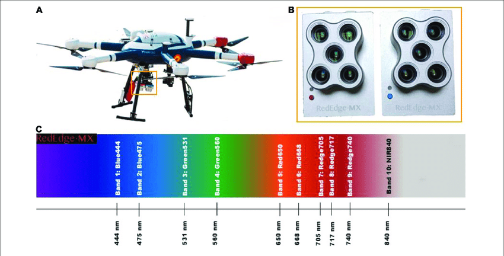

# Micasense RedEdge-MX DUAL processing
Simon Oiry

This workflow is an adaptation of the micasense workflow to process
manually images coming from the micasense RedEdge-MX Dual camera. The
original workflow can be found
[here](https://github.com/micasense/imageprocessing) and has originally
been written in Python.

## Packages

The first thing to do is to ensure that all the packages are ready to be
used. The [exiftoolr](https://github.com/JoshOBrien/exiftoolr) packages
is used to read Exif of tiff files. After installing the package you
will need to run this line of code : `exiftoolr::install_exiftool()`.

<details>
<summary>Code</summary>

``` r
require(tidyverse)
require(exiftoolr)
require(terra)
```

</details>

## Locate images



The dual-MX camera have a spectral resolution of 10 bands, ranging from
the blue (444nm) to the NIR (840nm). The following code is used to find
the path of each individual image, to identify each band of each image
and to extract all the metadata that will be needed.

<details>
<summary>Code</summary>

``` r
image_df<-"Dual_MX_Images" %>% 
  list.files(recursive = T, full.names = T) %>% 
  as.data.frame() %>% 
  rename(path = ".") %>% 
  mutate(image_name = gsub(".*/","",path),
         image_ID = substr(image_name,5,8),
         Band = paste0("B",gsub(".*_","",image_name) %>% gsub(".tif","",.))) 
```

</details>

## Reading metadata used to orthorectify, calibrate and align images

<details>
<summary>Code</summary>

``` r
meta <-data.frame(
  Image_name = image_df$image_name,
  Make = NA,
  Model = NA,
  Software = NA
)

for (i in 1:nrow(image_df)){
  exif<-exif_read(image_df$path[i])
}

# exif<-exif_read(img)
# 
# 
# exif$Make
```

</details>
